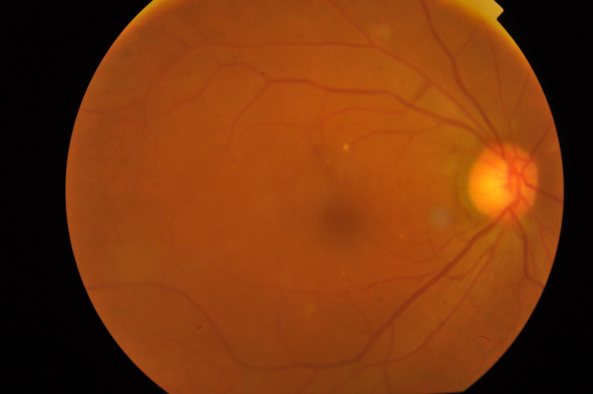

<!-- Improved compatibility of back to top link -->

<a id="readme-top"></a>

<!-- PROJECT LOGO -->

<br />
<div align="center">
  
  <h3 align="center">optiDR</h3>
  <p align="center">
    An EfficientNet-based Diabetic Retinopathy Classifier built with PyTorch
    
  </p>
</div>

## About The Project

optiDR is a deep learning project designed to classify retinal fundus images into diabetic retinopathy severity levels using EfficientNet-B7. It is modular, easy to extend, and tuned for readability and real-world use.

### Built With

* [PyTorch](https://pytorch.org/)
* [Torchvision](https://pytorch.org/vision/stable/index.html)
* [EfficientNet](https://paperswithcode.com/method/efficientnet)
* [Pandas](https://pandas.pydata.org/)
* [Matplotlib](https://matplotlib.org/)
* [scikit-learn](https://scikit-learn.org/stable/)

<p align="right">(<a href="#readme-top">back to top</a>)</p>

---

## Getting Started

### Prerequisites

* Python 3.8+
* pip or conda

### Installation

1. Clone the repo

   ```bash
   git clone https://github.com/yourusername/optiDR.git
   cd optiDR
   ```
2. Download the dataset from the APTOS 2019 Blindness Detection competition on Kaggle.
3. Place the following files in the data directory (create folder):
    - train_images
    - test_images
    - val_images (you can split from training manually)
    - train_1.csv, test.csv, valid.csv
4. Create virtual environment & install dependencies

   ```bash
   python -m venv venv
   source venv/bin/activate  # On Windows use: venv\Scripts\activate
   pip install -r requirements.txt
   ```

<p align="right">(<a href="#readme-top">back to top</a>)</p>

---

## Usage

Train the model:

```bash
python train.py
```

Evaluate on test set:

```bash
python test.py
```

All images and CSVs should be in:

```
data/
├── train_images/
├── val_images/
├── test_images/
├── train_1.csv
├── valid.csv
└── test.csv
```

<p align="right">(<a href="#readme-top">back to top</a>)</p>

---


## License

Distributed under the MIT License. See `LICENSE` for more information.

<p align="right">(<a href="#readme-top">back to top</a>)</p>

---

## Contact

**Mauricio Villavicencio**
[LinkedIn](https://www.linkedin.com/in/mauriciovillavicencio)
Project Link: [https://github.com/maurilaparva/optiDR](https://github.com/maurilaparva/optiDR)

<p align="right">(<a href="#readme-top">back to top</a>)</p>

---

## Acknowledgments

* [EfficientNet Paper](https://arxiv.org/abs/1905.11946)
* [APTOS 2019 Dataset](https://www.kaggle.com/competitions/aptos2019-blindness-detection)

<p align="right">(<a href="#readme-top">back to top</a>)</p>

<!-- MARKDOWN LINKS -->

[contributors-shield]: https://img.shields.io/github/contributors/yourusername/optiDR.svg?style=for-the-badge
[contributors-url]: https://github.com/yourusername/optiDR/graphs/contributors
[forks-shield]: https://img.shields.io/github/forks/yourusername/optiDR.svg?style=for-the-badge
[forks-url]: https://github.com/yourusername/optiDR/network/members
[stars-shield]: https://img.shields.io/github/stars/yourusername/optiDR.svg?style=for-the-badge
[stars-url]: https://github.com/yourusername/optiDR/stargazers
[issues-shield]: https://img.shields.io/github/issues/yourusername/optiDR.svg?style=for-the-badge
[issues-url]: https://github.com/yourusername/optiDR/issues
[license-shield]: https://img.shields.io/github/license/yourusername/optiDR.svg?style=for-the-badge
[license-url]: https://github.com/yourusername/optiDR/blob/main/LICENSE
[linkedin-shield]: https://img.shields.io/badge/-LinkedIn-black.svg?style=for-the-badge&logo=linkedin&colorB=555
[linkedin-url]: https://www.linkedin.com/in/mauriciovillavicencio
